# 🛒 闲淘 XianTao — 校园二手交易平台

[](https://spring.io/projects/spring-boot)
[](https://vuejs.org/)
[](https://www.oracle.com/java/)
[](https://www.mysql.com/)
[](https://uniapp.dcloud.net.cn/)
[](LICENSE)

> 前后端分离架构，三端并行（网页端 + 管理后台 + 微信小程序），担保交易保障资金安全

---

## ✨ 核心特性

- 🛡️ **担保交易** — 买家付款 → 平台托管 → 卖家发货 → 确认收货 → 资金解冻，全流程资金安全保障
- 📊 **信用体系** — 基于交易行为自动计算信用分（300-850），5 级信用等级可视化展示
- 🚚 **物流追踪** — 支持主流物流公司，模拟物流轨迹实时可视化展示
- 📱 **三端并行** — 网页端（Vue 3）、管理端（Vue 3 + ECharts）、小程序端（uni-app）
- 🔐 **JWT 认证** — Token 有效期 24 小时，BCrypt 密码加密，Spring Validation 参数校验
- 📈 **数据看板** — 管理端集成 ECharts 可视化统计，实时掌握平台运营数据

---

## 🚀 快速开始

### 环境要求

| 环境 | 最低版本 | 说明 |
|------|---------|------|
| JDK | 21+ | 后端运行环境 |
| Node.js | 18+ | 前端构建工具 |
| Maven | 3.8+ | Java 项目管理 |
| MySQL | 8.0+ | 关系型数据库 |

### 1️⃣ 数据库初始化

```bash
mysql -u root -p
source e:/xiantao/xiantao-server/sql/init.sql
```

### 2️⃣ 启动后端

```bash
cd xiantao-server
mvn spring-boot:run
```

> 后端默认运行在 `http://localhost:8080`

### 3️⃣ 启动前端

**网页端：**
```bash
cd xiantao-web && npm install && npm run dev
# → http://localhost:5173
```

**管理后台：**
```bash
cd xiantao-admin && npm install && npm run dev
# → http://localhost:5174
```

**微信小程序端：**
```bash
cd xiantao-miniprogram && npm install && npm run dev:h5
```

### 🔑 测试账号

| 账号 | 密码 | 角色 | 余额 |
|------|------|------|------|
| test001 | 123456 | 普通用户 | ¥10,000 |
| test002 | 123456 | 普通用户 | ¥8,000 |
| test003 | 123456 | 普通用户 | ¥5,000 |
| admin | 123456 | 管理员 | ¥99,999 |

---

## 🏗️ 系统架构

### 分层架构图

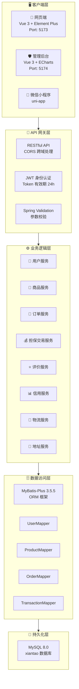

### 技术栈全景

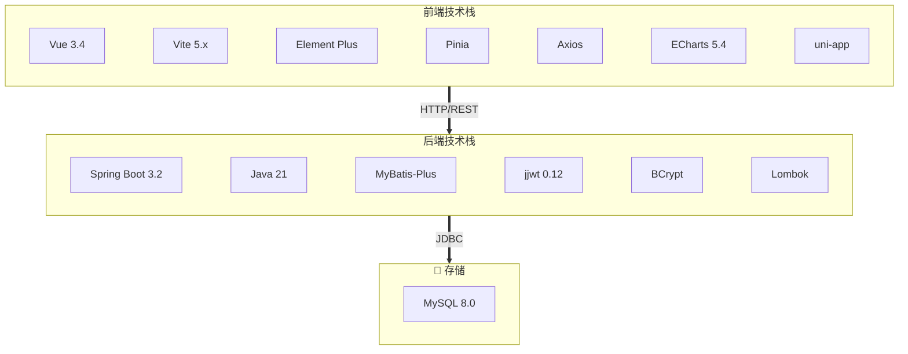

---

## 🔄 核心业务流程

### 担保交易流程图

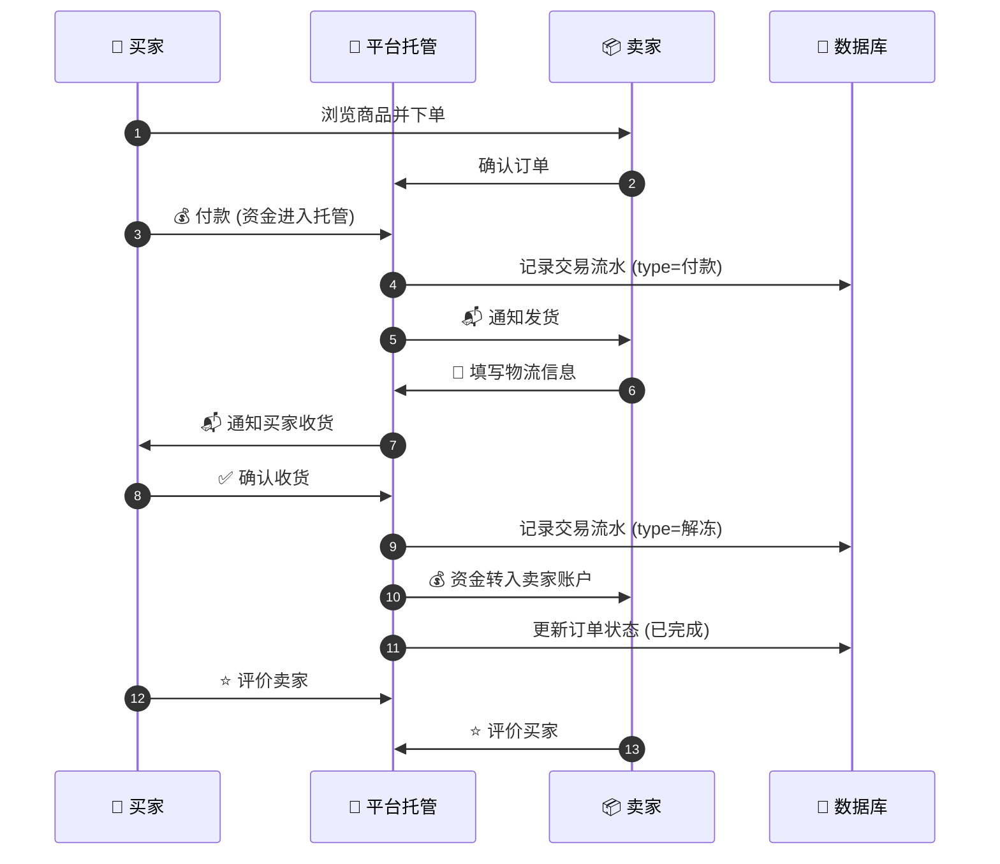

### 资金流向图

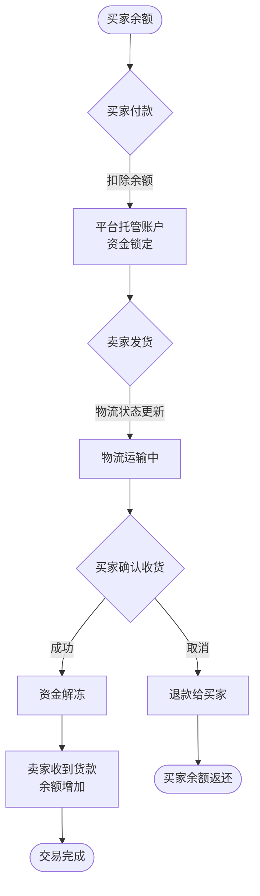

### 订单状态流转图

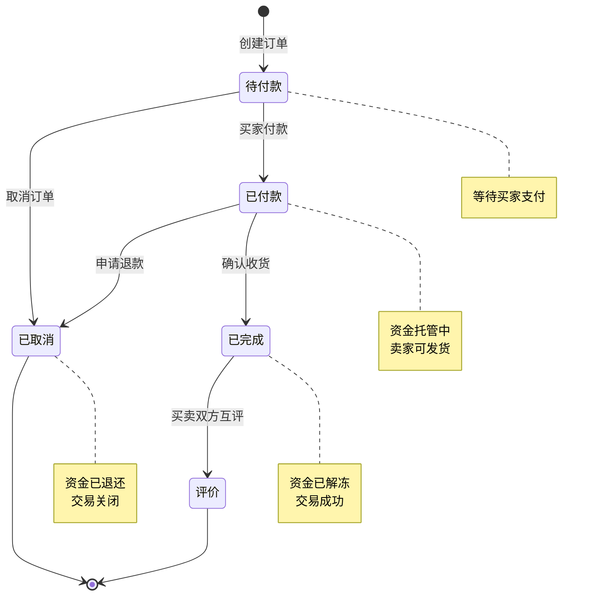

---

## 📊 信用体系

### 信用分计算模型

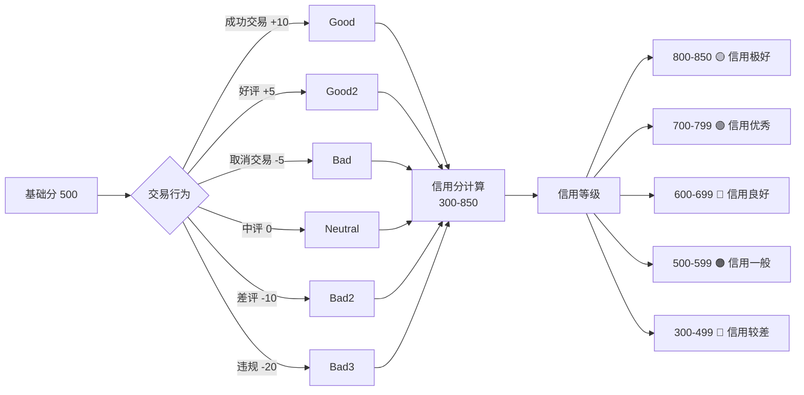

---

## 🗄️ 数据库设计

### ER 关系图

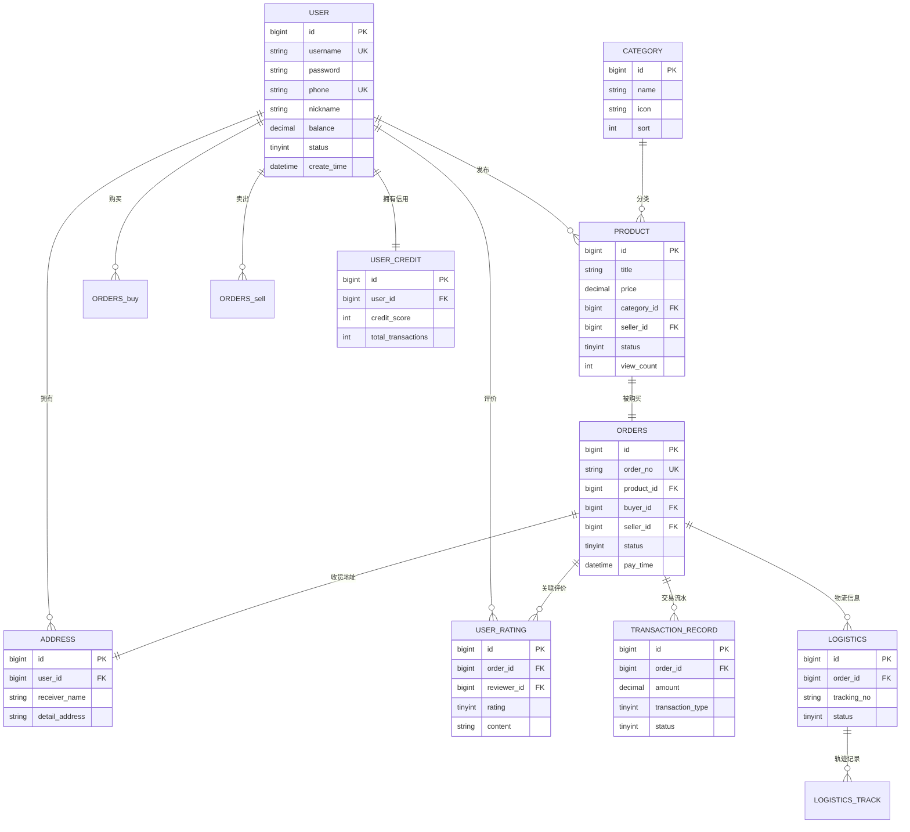

### 数据流向图 (DFD)

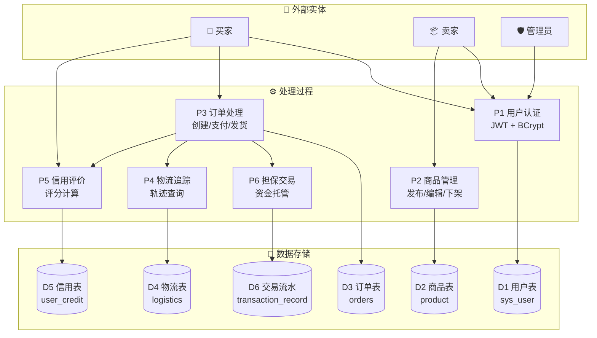

---

## 📦 功能模块

### 模块总览

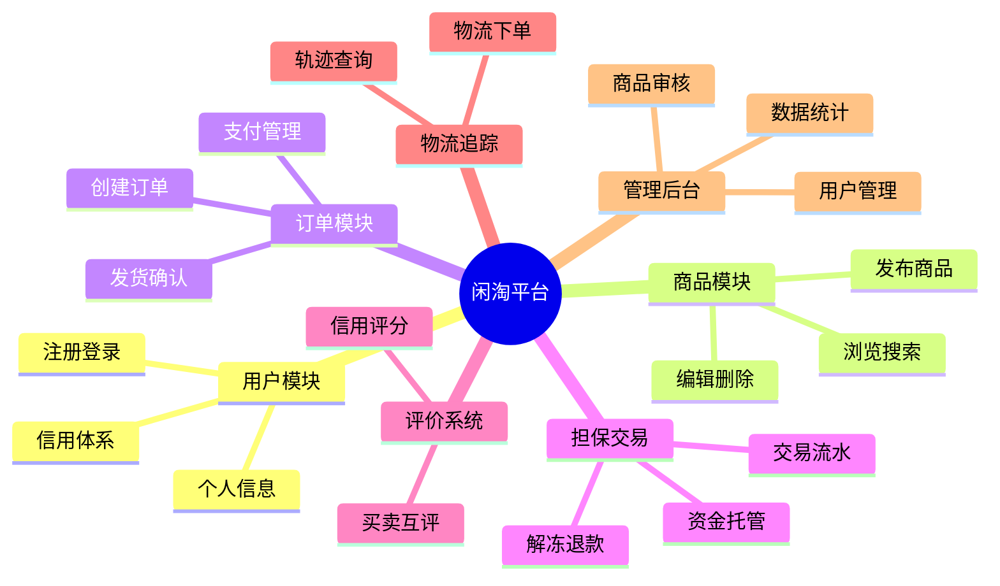

| 模块 | 功能 | Controller | Service | 状态 |
|------|------|-----------|---------|------|
| 👤 用户 | 注册、登录、信息管理 | `AuthController`<br/>`UserController` | `UserService` | ✅ |
| 📱 商品 | 发布、浏览、搜索、编辑 | `ProductController` | `ProductService` | ✅ |
| 📂 分类 | 分类管理、筛选 | `CategoryController` | `CategoryService` | ✅ |
| 🛒 订单 | 创建、支付、发货、确认 | `OrderController` | `OrderService` | ✅ |
| 💰 担保交易 | 资金托管、解冻、退款 | `TransactionRecordController` | `TransactionRecordService` | ✅ |
| ⭐ 评价 | 买卖互评、信用评分 | `UserRatingController` | `UserRatingService` | ✅ |
| 📍 地址 | 收货地址管理 | `AddressController` | `AddressService` | ✅ |
| 🚚 物流 | 物流下单、轨迹查询 | `LogisticsController` | `LogisticsService` | ✅ |
| 🛡️ 管理 | 用户/商品/订单/数据统计 | `Admin*Controller` (4个) | 各Service | ✅ |

---

## 📁 项目结构

```
xiantao/
├── xiantao-server/                  # 后端服务 (Spring Boot 3.2.3)
│   ├── src/main/java/com/xiantao/
│   │   ├── common/                  # 公共组件：异常、响应、全局处理
│   │   ├── config/                  # 配置：跨域、JWT 拦截器、Web 配置
│   │   ├── controller/              # 控制层 (16 个 Controller)
│   │   ├── service/                 # 业务层 (10 个 Service)
│   │   │   └── impl/                # 服务实现类
│   │   ├── mapper/                  # 数据访问层 (10 个 Mapper)
│   │   ├── entity/                  # 数据库实体类 (10 个)
│   │   ├── dto/                     # 请求参数对象 (10 个)
│   │   ├── vo/                      # 响应视图对象 (11 个)
│   │   ├── utils/                   # 工具类 (JWT、密码生成)
│   │   └── XiantaoApplication.java  # 启动入口
│   ├── src/main/resources/
│   │   └── application.yml          # 应用配置
│   ├── sql/                         # 数据库初始化脚本
│   └── pom.xml                      # Maven 依赖配置
│
├── xiantao-web/                     # 网页端 (Vue 3 + Element Plus)
│   ├── src/
│   │   ├── api/                     # API 请求封装 (9 个模块)
│   │   ├── router/                  # 路由配置
│   │   ├── stores/                  # Pinia 状态管理
│   │   ├── views/                   # 页面组件 (14 个页面)
│   │   └── utils/                   # Axios 拦截器
│   └── vite.config.js
│
├── xiantao-admin/                   # 管理后台 (Vue 3 + ECharts)
│   ├── src/
│   │   ├── router/                  # 路由配置
│   │   ├── utils/                   # 工具类
│   │   └── views/                   # 管理页面 (9 个页面)
│   └── vite.config.js
│
├── xiantao-miniprogram/             # 微信小程序端 (uni-app)
│   ├── api/                         # API 封装
│   ├── pages/                       # 页面
│   └── src/                         # uni-app 源码
│
├── README.md                        # 技术文档 (本文件)
├── 二手交易平台-产品设计书.md        # 产品设计文档
├── 二手交易平台-实施计划书.md        # 项目实施计划
└── 闲淘平台-API接口文档.md           # API 接口文档
```

---

## 🔌 API 接口概览

### 接口全景图

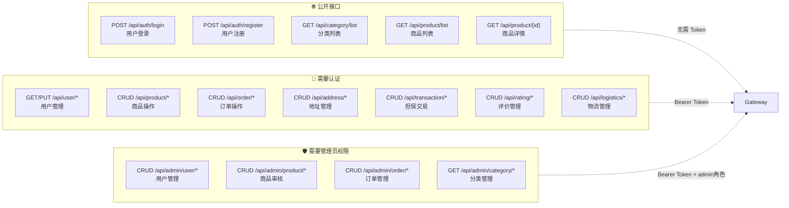

### 接口列表

| 模块 | 基础路径 | 接口数 | 认证 |
|------|---------|--------|------|
| 认证模块 | `/api/auth` | 2 | 公开 |
| 用户模块 | `/api/user` | 3 | JWT |
| 分类模块 | `/api/category` | 1 | 公开 |
| 商品模块 | `/api/product` | 8 | JWT |
| 订单模块 | `/api/order` | 7 | JWT |
| 地址模块 | `/api/address` | 6 | JWT |
| 担保交易 | `/api/transaction` | 5 | JWT |
| 评价模块 | `/api/rating` | 4 | JWT |
| 物流模块 | `/api/logistics` | 4 | JWT |
| 管理模块 | `/api/admin` | 13 | JWT (admin) |

### 统一响应格式

```json
{
  "code": 200,
  "message": "success",
  "data": { ... }
}
```

### 核心接口示例

**用户登录：**
```bash
curl -X POST http://localhost:8080/api/auth/login \
  -H "Content-Type: application/json" \
  -d '{"username": "test001", "password": "123456"}'
```

**发布商品：**
```bash
curl -X POST http://localhost:8080/api/product \
  -H "Authorization: Bearer <token>" \
  -H "Content-Type: application/json" \
  -d '{"title": "iPhone 14 Pro", "price": 5999.00, "categoryId": 1}'
```

---

## 🛡️ 安全机制

### 安全架构图

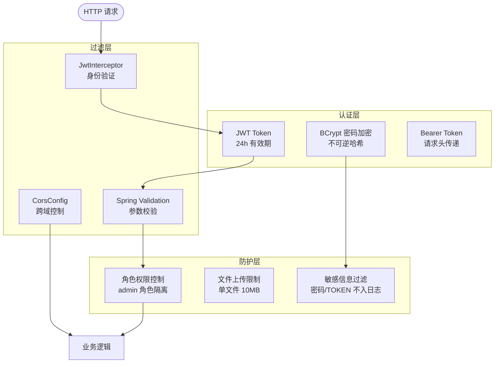

| 机制 | 实现方式 | 说明 |
|------|---------|------|
| 密码加密 | BCrypt | 不可逆哈希，存储安全 |
| 身份认证 | JWT Token | 24 小时有效期 |
| 角色控制 | 自定义拦截器 | admin 角色隔离 |
| 参数校验 | Spring Validation | DTO 层级校验 |
| 跨域处理 | CorsConfig | 允许前端跨域访问 |
| 文件上传 | Multipart 限制 | 单文件 10MB，总请求 50MB |

---

## 🚢 部署指南

### 一键启动 (Docker Compose)

```yaml
version: '3.8'
services:
  mysql:
    image: mysql:8.0
    environment:
      MYSQL_ROOT_PASSWORD: 123456
      MYSQL_DATABASE: xiantao
    volumes:
      - ./sql/init.sql:/docker-entrypoint-initdb.d/init.sql
    ports:
      - "3306:3306"

  backend:
    build: ./xiantao-server
    depends_on:
      - mysql
    ports:
      - "8080:8080"

  frontend:
    image: node:18-alpine
    working_dir: /app
    volumes:
      - ./xiantao-web:/app
    command: npm run dev
    ports:
      - "5173:5173"
```

```bash
docker-compose up -d
```

---

## 📚 文档资源

| 文档 | 说明 |
|------|------|
| [产品设计书](二手交易平台-产品设计书.md) | 完整产品需求与设计文档 |
| [实施计划书](二手交易平台-实施计划书.md) | 项目实施计划与里程碑 |
| [API 接口文档](闲淘平台-API接口文档.md) | 详细 RESTful API 文档 |
| [数据库脚本](xiantao-server/sql/init.sql) | 数据库初始化 SQL |

---

## ❓ 常见问题

**Q: 启动后端报错 "Cannot connect to database"**
> 检查 MySQL 是否启动，`application.yml` 配置是否正确，数据库 `xiantao` 是否已创建

**Q: 前端请求跨域报错**
> 确认后端已启动，项目已配置 `CorsConfig.java`

**Q: Token 过期如何处理**
> 前端响应拦截器捕获 401，清除本地 Token 并跳转登录页

---

<p align="center">
  <strong>如果这个项目对您有帮助，请给我们一个 ⭐</strong>
</p>
