# 🛒 闲淘 XianTao — 架构与流程图集（Mermaid）

> 本文件仅收录项目的 Mermaid 图表，作为 [README.md](README.md) 的可视化配套。
> 项目说明、快速开始、测试账号、接口列表、部署步骤等文字内容以 README.md 为唯一真相源，本文件不重复维护。
> 图表可在 GitHub / VS Code / Trae IDE 直接渲染。

> 共 11 张图。

---
## 分层架构图

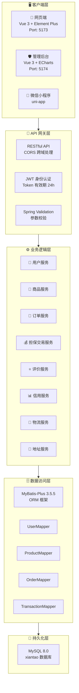

---

## 技术栈全景

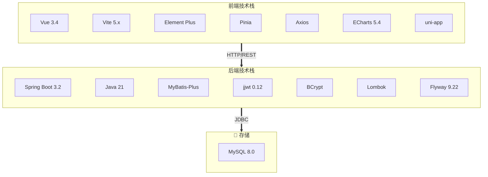

---

## 担保交易流程图

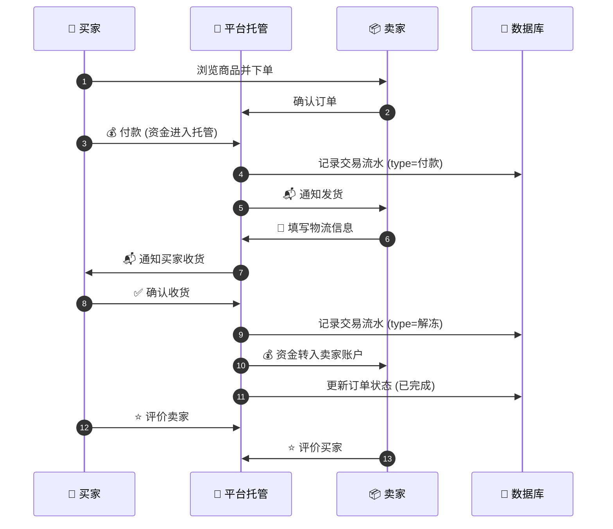

---

## 资金流向图

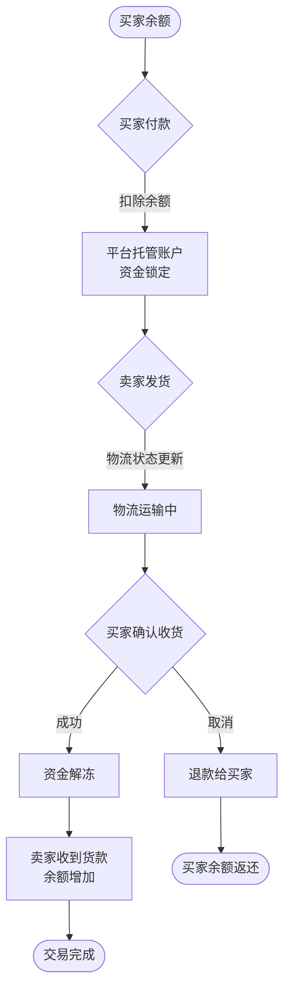

---

## 订单状态流转图

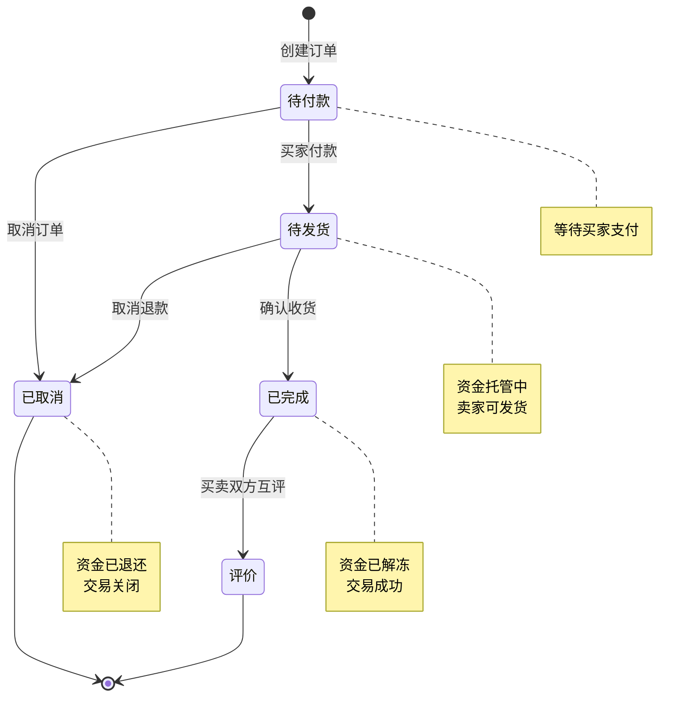

---

## 信用分计算模型

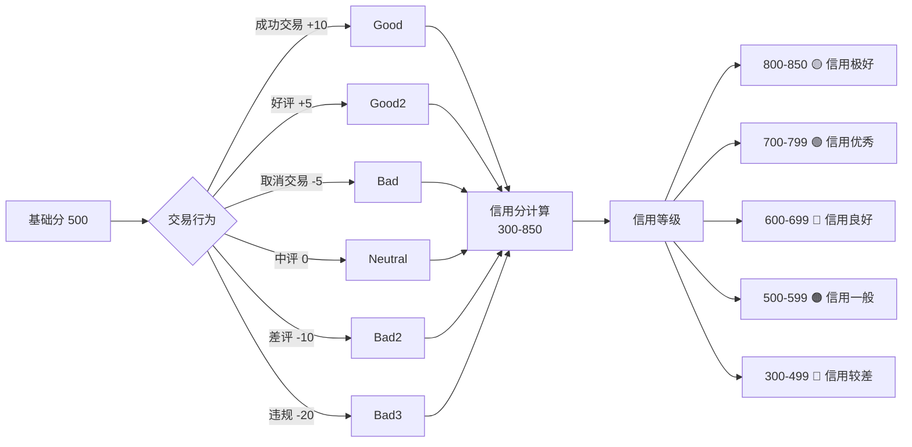

---

## ER 关系图

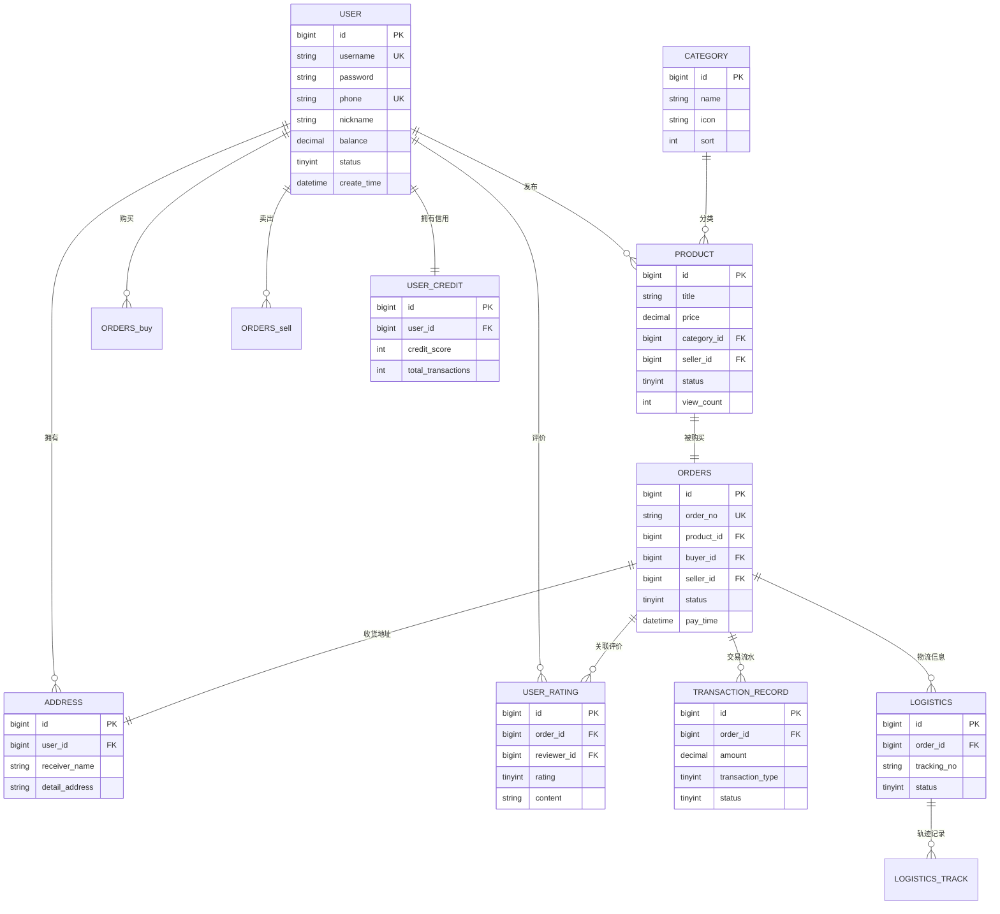

---

## 数据流向图 (DFD)

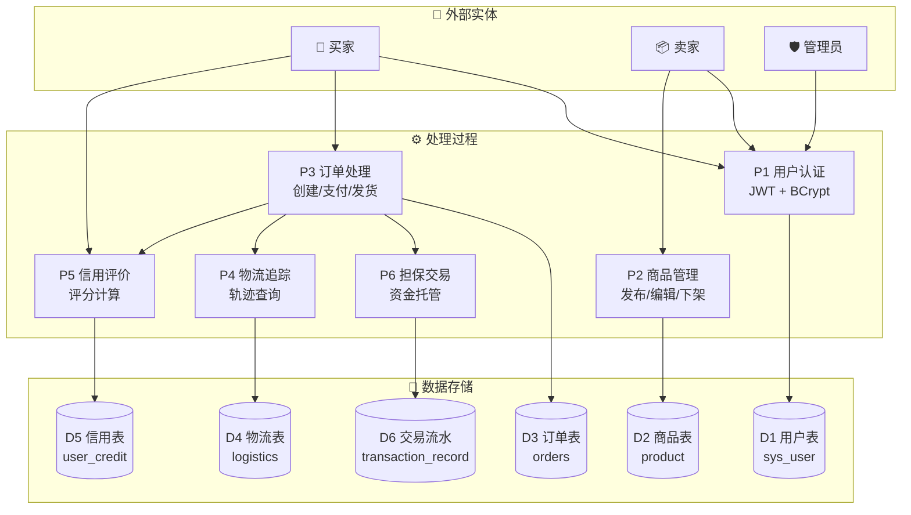

---

## 模块总览

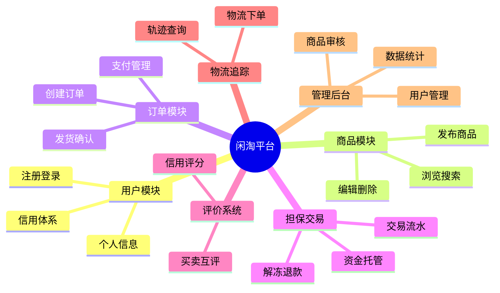

---

## 接口全景图

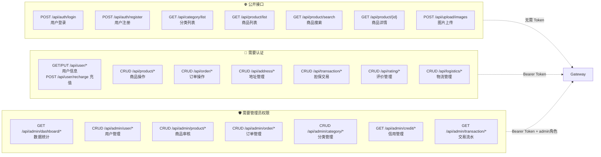

---

## 安全架构图

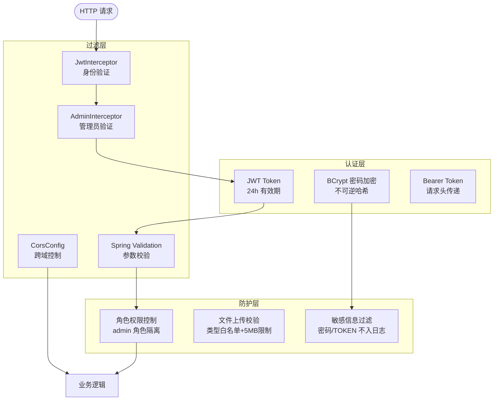

